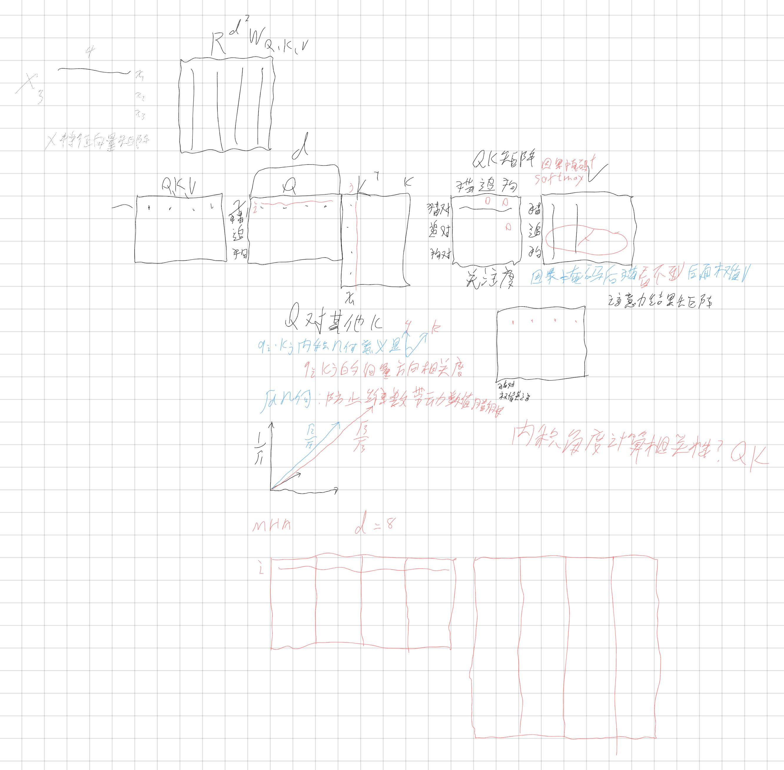

# 2026-09-14 学习记录

## 今日主题

- 深度学习：注意力机制的数学原理推导（结合手稿）+ KV cache / prefill 的自主理解 + Block 结构与输出头问答

> 📒 当日手稿：[点击直达手稿原图](../assets/9.14-notes.jpg)
>
> 

---

## 一、整体图景：X 矩阵与投影

输入矩阵 X 是特征向量矩阵：每行是一个词的特征向量（x₁, x₂, x₃），d=4，即 X ∈ ℝ³ˣ⁴。

三个权重矩阵 W_Q, W_K, W_V ∈ ℝᵈˣᵈ（参数量各为 d²），右乘 X 完成线性投影，把同一个词向量分别映射到三个不同子空间：

- **Q（查询）**：当前词在寻找什么样的特征
- **K（键）**：当前词能提供什么特征来匹配
- **V（值）**：当前词携带的核心语义信息

## 二、QKᵀ 内积：用几何度量相关性

得分矩阵 S = QKᵀ/√d，其中元素：

$$S_{ij} = \frac{1}{\sqrt{d}} \langle q_i, k_j \rangle$$

**内积的几何意义**（手稿核心理解）：

$$\vec{q_i} \cdot \vec{k_j} = \|q_i\| \, \|k_j\| \cos\theta$$

内积 = 两向量模长 × 夹角余弦 → 度量的是 **q_i 与 k_j 的向量方向相关度**：夹角越小、方向越一致，分值越高，表示词 i 对词 j 的关联越强。

**矩阵化视角**：Q 的第 i 行 × Kᵀ 的第 j 列（即 K 的第 j 行），一次矩阵乘法算完所有词对之间的相关度。

## 三、√d 缩放的几何/统计原因

**手稿里的几何直觉**（勾股定理推广）：

- 1 维：x 轴上长度为 1 的向量，模长 = 1 = √1
- 2 维：(1, 1) 的模长 = √2（平面勾股定理）
- 3 维：(1, 1, 1) 的模长 = √3（立体几何，体对角线）
- d 维：全 1 向量模长 = √d —— 每加一个维度，根号里 +1

所以点积的"典型大小"随维度以 √d 膨胀；除以 √d 就把模长拉回 1 附近，与维度脱钩。

**统计视角的同一事实**：若 q、k 各分量均值 0、方差 1 且独立，内积 Σ qᵢkⱼ 的方差 = d，标准差 = √d。两种说法等价：√d 是点积的"天然尺度"。几何的模长与统计的方差是同一个代数结构（平方和）的两张面孔。

**不缩放的后果**：d 很大时内积数值巨大，softmax 被推入饱和区——输出几乎全是 0 和 1（one-hot 化），梯度趋近于 0，训练停滞。缩放后权重分布保持"软"，梯度健康。

## 四、Softmax：从分数到概率分布

$$A_{ij} = \frac{\exp(S_{ij})}{\sum_k \exp(S_{ik})}$$

对每一行归一化，使每行满足：A_ij ∈ (0,1) 且 Σ_j A_ij = 1——每行是一个**概率分布向量**（落在标准单纯形上）。

数值稳定技巧：softmax(x - max) 与 softmax(x) 数学等价（e^{-c} 上下约掉），但保证指数输入最大为 0，杜绝浮点溢出。

## 五、凸组合：注意力的输出本质

$$\vec{o_i} = \sum_j A_{ij} \vec{v_j}$$

由于权重非负且和为 1，每个词的新表示 = 所有词的 V 向量以 A 为权重的**凸组合**（质心插值）。语义闭环：第 2 步内积大 → 第 3 步权重高 → 第 4 步大量融合对方的 V 特征。

## 六、因果掩码（手稿标注）

QK 矩阵上三角（未来位置）置 0/-∞，softmax 后权重归零：第 1 行（"猫"）只能看自己，看不到后面的词——训练并行时防止偷看未来，也保证了推理时 KV cache 的精确等价（见 9.13 记录）。

## 全景公式

$$\text{Attention}(Q,K,V) = \text{Softmax}\left(\frac{QK^T}{\sqrt{d}}\right)V$$

维度流动：(3×4) × (4×3) → (3×3) → Softmax → (3×3) × (3×4) = (3×4)

---

## 疑问与 AI 解答

**Q1（自问）**：训练时因果掩码是必须的（防偷看导致贪婪），但接收用户一次性输入（prefill）后计算 QK 注意力矩阵，还需要因果掩码吗？prompt 已经全部给出，感觉没什么好偷看的——或许只是为了架构和流程一致的优美？

**A1**：需要，而且理由比"一致性优美"更硬——**分布一致性**。模型的全部参数是在因果掩码下训练出来的，它期望每个位置的表示只由左侧文本构建。若 prefill 去掉掩码，每个词的 K/V 会混入右侧信息，偏离训练分布，生成质量立刻下降。另一个细节：prefill 时用来预测第一个新词的是最后一个位置的输出——掩码下它是唯一"看全了"整个 prompt 的位置。所以掩码的本质不是防偷看，而是保证**推理时的表示构建方式与训练时逐位一致**。

**Q2**：一个层长什么样？是 MHA + FFN 吗？各接一个层归一化和残差？两个子层就是 MHA 和前馈网络？先 MHA 后 FFN？输出作为下一层输入？

**A2**：全对。一个 Block = 两个子层（MHA 子层 + FFN 子层，先 MHA 后 FFN），每个子层各自配一套残差 + LayerNorm，所以一层有两个 LN、两个残差。现代模型多用 pre-norm（LN 放子层前面），原版论文是 post-norm。`(n, d)` 形状守恒让上一层的输出原封不动成为下一层的输入。

**Q3**：每一层的 W_q/k/v 都一样吗？

**A3**：**不一样**——每层有独立的一整套参数（W_q/k/v、W_o、W₁、W₂、γ、β 全部独立），96 层 = 96 套，这是参数量达千亿级的原因。直觉：浅层学局部语法，深层学抽象语义，分工不同所以参数不能共享。

**Q4**：LayerNorm 的 γ、β 是逐维度定制化的，定制化就要绑定位置并协同进化——所以每个 LN 绑定它前面的 MHA/FFN 协同训练，对吗？

**A4**：对。γ、β 是逐维度的可学习向量，每个 LN 实例有独立的一对，绑死在网络的固定位置上，和整个网络一起被反向传播训练。它只服务于那个位置的数值分布。

**Q5（自问自推）**：预测下一个词的环节在 x 跑完所有层之后？再经处理获得新词，新词和 KV cache 作为输入喂回网络，不断循环就是 App 上流式加载的原因？这就是自回归——"自己回归到网络前面再跑一次"？

**A5**：推测全部正确，补上最后拼图：x 跑完所有层 → 最终 LayerNorm → **LM Head**（一个 (d, 词表大小) 的线性层，本质是又一次矩阵乘法）→ 词表上每个词一个分数（logits）→ softmax → 采样 → 新词 → 追加进输入与 KV 缓存 → 再跑一遍。"跑一次一个字"正是自回归的本义；App 上的逐字蹦出不是特效，是 decode 循环的真实速度。

**术语澄清**：两个"解码"别混——① **decoder-only 架构**：GPT 这类模型的整体结构（带因果掩码的 Block 堆叠）；② **decode 阶段**：推理时逐词生成的循环（相对 prefill）。Q5 说的是后者中的 LM Head + 采样环节。

## AI 纠错求证自我理解

**原理解**：一次性输入完整的 X 并计算 QKV 矩阵，是在训练或接收用户输入后（prefill）做的。decode 时 Q_new 是接收的第一个新词，只用新词看旧词就能理解，所以输入是 (1, d)；让 new 看旧词，旧词不查询；这一行的 K/V 拼进前面的 KV 矩阵，只用这一行的 Q 进行查询，后面的自回归编码流程以此类推。

**A**：主干完全正确，三点都对：① decode 输入形状 (1, d)；② 旧词不发起查询、只被查；③ 新词的 K/V 追加进缓存，每步只用新词的 Q 查询一次。两处小修正：

1. **术语**：这个过程叫自回归**解码（decode）**，不是"编码"——编码器/解码器是固定术语，混用以后会造成理解错位。
2. **时序细节**：第一个新词并不是从 decode 步产生的——它由 prefill 阶段最后一个位置的输出直接给出；新词作为输入进入 decode 后，才走"Q_new 查缓存"的流程。即 prefill 既建缓存，也顺带产出第一个词。

---

## 今日小结

把手稿里的几何直觉（内积 = 方向相关度；√d = 维度对角线长度）和数学推导（方差解释、凸组合）对齐了；自主推出 prefill/decode 两阶段图景，并追问到"prefill 是否需要掩码"（答案：分布一致性）；通过一轮结构问答补齐了 Block 的完整样貌（双子层、各带残差+LN、每层参数独立）和输出头（LM Head + 采样 = 自回归生成）。前向传播至此无黑盒。
